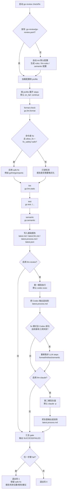

# go-review

`go-review` 是一个面向 Go 项目的代码审阅编排工具。它把格式化、静态检查、测试、语义规则和可选 LLM 审阅放到同一条可配置流水线里，并输出稳定的中文报告、JSON 报告和 LLM 修复上下文。


## 主流程图



### 流程要点

- `check` 永远只读；`fix` 只会自动执行 `allow_fix: true` 且 `fix_safety: safe` 的步骤。
- safe fix 成功后不会因为后续 lint/test/semantic 失败而回滚；后续失败会进入 `latest.process.md` 和终端失败摘要。
- lint / semantic / test 这类只检测不修复的步骤，会在报告中提供 rule_id、文件位置、失败信息和建议；不是只显示 failed。
- `llm-review` 和 `llm-claude` 是可配置角色：默认是 Codex 修改、Claude 复盘，但可以通过 adapter command/args 调整为其它 CLI 或相反分工。
- `latest.process.md` 是主阅读入口；`latest.llm.md` 是给模型消费的稳定修复上下文。

## 当前能力

当前版本已经实现以下能力：

1. `go-review` CLI：支持 `check`、`fix`、`init`、`rules`、`update`、`version`。
2. 默认配置发现：优先读取 `.go-review/go-review.yaml`，其次读取 `go-review.yaml`；缺失时可自动初始化。
3. `go.lint` adapter：通过 `golangci-lint fmt/run` 承接格式化和静态检查。
4. `go.test` adapter：通过 `go test ./...` 执行测试。
5. `go.semantic` adapter：通过 `go/analysis` 执行确定性 AST / type info 语义规则。
6. `llm.review` adapter：可选调用 `codex exec` 执行 LLM 审阅，默认关闭。
7. `llm.claude` adapter：可选在 Codex 之后调用 Claude Code 做第二模型复审和修复点评，默认关闭。
8. 安全自动修复：`fix` 只会执行 `allow_fix: true` 且 `fix_safety: safe` 的步骤；后续验证失败会保留 safe fix 并报告失败。
9. 失败隔离：默认 `on_fail: continue`，一个部分失败不会阻止其它部分运行。
10. 报告输出：生成面向人、LLM 和机器的 Markdown / JSON 报告。
11. 规则 catalog：支持 JSON 规则库的校验、查询、增删改和 Markdown 渲染。
12. 主动升级检测：`go-review update` 只在用户确认后替换执行文件，并只追加缺失的新配置。

## 安装

从源码构建到本机 `~/bin`：

```bash
go build -o ~/bin/go-review ./cmd/go-review
```

确认命令可用：

```bash
go-review version
go-review --help
```

`go.lint` 默认依赖 `golangci-lint`：

```bash
go install github.com/golangci/golangci-lint/v2/cmd/golangci-lint@latest
```

如果要启用 Codex LLM 审阅，需要本机 `codex` 命令可用并完成登录；如果要启用 Claude 二次复审，需要本机 `claude` 命令可用并完成登录。

## 快速开始

在一个 Go 项目根目录执行：

```bash
go-review init
```

会生成：

```text
.go-review/go-review.yaml
.go-review/rules.json
.go-review/llm-rules.json
.go-review/semantic/default.yaml
.go-review/semantic/custom.yaml
```

然后运行默认快速检查：

```bash
go-review
```

它等价于：

```bash
go-review check --profile fast
```

默认 `fast` profile 会执行：

```text
format-check -> test
```

## 常用命令

### 只读检查

```bash
go-review check --profile fast
```

`check` 永远只读，不会修改源码。

### 完整 CI 检查

```bash
go-review check --profile ci
```

默认 `ci` profile 会执行：

```text
format-check -> lint -> test -> semantic
```

每个步骤默认 `on_fail: continue`，所以 format/lint/semantic/test 任一失败都不会阻止其它步骤继续运行；最终 gate 仍会按整体失败返回非零退出码。

### 安全自动修复

```bash
go-review fix --profile fast
```

当前默认安全修复主要用于格式化：

- `format-check` 使用 `go.lint.format`。
- 底层执行 `golangci-lint fmt`。
- 只有 `allow_fix: true` 且 `fix_safety: safe` 时才会改文件。
- 修复后会继续跑后续验证；验证失败会保留已经应用的 safe fix，并在报告/过程文档中标记失败。

### 指定配置或工作目录

```bash
go-review check \
  --config .go-review/go-review.yaml \
  --profile ci \
  --workdir .
```

### 指定报告目录

```bash
go-review check --profile ci --report-dir /tmp/go-review-report
```

### 主动检测并升级

```bash
go-review update
```

`update` 是单一入口，不会默认自动升级。它会先访问 GitHub Release 检测最新版本：

1. 如果当前已经是最新版，只输出当前版本状态。
2. 如果发现新版本，先展示 release 概要。
3. 询问 `是否升级？[y/N]`。
4. 只有输入 `y` 或 `yes` 后才执行升级。

确认升级后会做两类事情：

- 替换当前 `go-review` 执行文件，并保留旧二进制备份。
- 如果当前项目能发现 `.go-review/go-review.yaml` 或 `go-review.yaml`，则只追加新版本缺失的默认配置。

配置合并遵守“只追加、不覆盖”：

- 已有 adapter / step / profile 配置会跳过。
- 用户改过的参数不会被替换。
- 新增的 LLM/Claude 配置默认 `enabled: false`，不会改变老项目行为。

非交互环境可以显式确认：

```bash
go-review update --yes
```

配置文件不在默认位置时，可以指定：

```bash
go-review update --config path/to/go-review.yaml
```

## 默认 profile

| Profile | 默认步骤 | 用途 |
| --- | --- | --- |
| `fast` | `format-check`, `test` | 本地快速检查。 |
| `ci` | `format-check`, `lint`, `test`, `semantic` | CI / PR 门禁。 |
| `nightly` | `format-check`, `lint`, `test`, `semantic` | 定时回归；当前与 `ci` 一致。 |
| `review` | `format-check`, `lint`, `test`, `semantic`, `llm-review`, `llm-claude` | 预留 LLM 审阅场景；两个 LLM step 默认关闭。 |

## 默认 adapter

| Adapter | 底层技术 | 职责 |
| --- | --- | --- |
| `go.lint` | `golangci-lint` | 格式化检查、静态检查、linter 输出归一。 |
| `go.test` | `go test ./...` | 执行 Go 测试。 |
| `go.semantic` | `go/analysis` | 执行确定性 AST / type info 语义规则。 |
| `llm.review` | `codex exec` | 可选 Codex 审阅和修复提示，默认关闭。 |
| `llm.claude` | `claude -p` | 可选 Claude 二次复审，消费 latest.llm.md 和 Codex 产物，默认关闭。 |
| `cmd` | 外部命令 | 通用命令 adapter，用于扩展其它工具。 |

## semantic 规则

内置 semantic 规则在：

```text
.go-review/semantic/default.yaml
```

当前默认内置规则：

```yaml
rules:
  - import-blank
  - custom-contexts
  - no-tfatal-goroutine
  - channel-size
  - enum-start-one
  - exit-in-main
  - no-direct-os-getenv
```

团队自定义 semantic 规则在：

```text
.go-review/semantic/custom.yaml
```

当前支持的自定义规则类型：

```yaml
kind: no-direct-call
kind: max-params
```

示例：限制函数或方法入参不能超过 4 个。

```yaml
rules:
  - id: max-four-params
    kind: max-params
    max: 4
    message: "方法入参不能超过 4 个"
    suggestion: "拆分参数对象或引入配置结构"
```

配置后运行包含 `semantic` step 的 profile 即可生效：

```bash
go-review check --profile ci
```

## LLM 审阅

LLM 审阅规则会初始化到：

```text
.go-review/llm-rules.json
```

`llm.review` 默认关闭，不会隐式调用模型。需要启用时，在 `.go-review/go-review.yaml` 中把对应 step 改成：

```yaml
- id: llm-review
  adapter: llm.review
  enabled: true
  on_fail: continue
```

然后运行包含该 step 的 profile：

```bash
go-review check --profile review
```

启用后，go-review 会直接调用：

```bash
codex exec --cd <project> -
```

如果希望 Codex 完成后再让 Claude 做一次独立点评和必要修复，可以再启用：

```yaml
- id: llm-claude
  adapter: llm.claude
  enabled: true
  on_fail: continue
```

默认调用形态是：

```bash
claude -p --permission-mode acceptEdits '<go-review 生成的复审提示词>'
```

`llm-claude` 会读取 `latest.llm.md`、`.go-review/llm-rules.json` 以及 `llm-review` 的 stdout/stderr 产物。它是可选第二模型复审，不替代确定性 lint / semantic / test 验证。Claude 的复审 stdout 会追加到统一过程文档 `.go-review/reports/latest.process.md`，并参与 `.go-review/reports/runs/<timestamp>.process.md` 归档。

## 报告位置

默认报告输出到：

```text
.go-review/reports/latest.md
.go-review/reports/latest.llm.md
.go-review/reports/latest.process.md      # 统一过程文档：safe fix、检测意见、LLM 修改和复盘
.go-review/reports/latest.json
.go-review/reports/runs/<timestamp>.md
.go-review/reports/runs/<timestamp>.llm.md
.go-review/reports/runs/<timestamp>.process.md
.go-review/reports/runs/<timestamp>.json
```

命令 stdout/stderr 等原始产物输出到：

```text
.go-review/artifacts/latest/
```

`latest.process.md` 是主阅读入口，用来串起 safe fix、lint/semantic/test 检测意见、Codex 修改和 Claude 复盘。`latest.llm.md` 仍然有用，但定位是稳定的模型输入上下文；Codex adapter、Claude adapter 和人工复查都可以读取它。

## 规则 catalog

规则数据源位于：

```text
rules/go-rules.json
```

常用命令：

```bash
go-review rules validate --catalog rules/go-rules.json
go-review rules list --catalog rules/go-rules.json
go-review rules get --catalog rules/go-rules.json --id go.official.gofmt
go-review rules render-doc --catalog rules/go-rules.json --out docs/quality/go-rule-catalog.md
```

报告中的 `rule_id` 会尽量回到这个 catalog，方便追踪规则来源、处理方式和实现状态。

## 本仓库自检

本仓库可以直接运行：

```bash
go test ./...
go-review check --profile fast
go-review check --profile ci
```

其中 `.go-review/go-review.yaml` 是本仓库自己的 dogfooding 配置。`testdata` 默认被本仓库配置排除，避免故意违规 fixture 被格式化或语义检查误扫。

## 发布

发布流程见：

- [`docs/release.md`](docs/release.md)
- [`.github/workflows/release.yml`](.github/workflows/release.yml)

发布 workflow 会基于 tag 构建多平台二进制、写入 checksum，并把本文档打包为 release QUICKSTART。

## 更多文档

- [产品说明](docs/product/go-code-quality-governance.md)
- [为什么需要 go-review](docs/product/why-go-review.md)
- [后端设计](docs/backend/rule-engine-and-autofix.md)
- [规则 catalog](docs/quality/go-rule-catalog.md)
- [消费方接入](docs/adoption/consumer-project.md)
- [文档与仓库结构](docs/documentation-structure.md)
