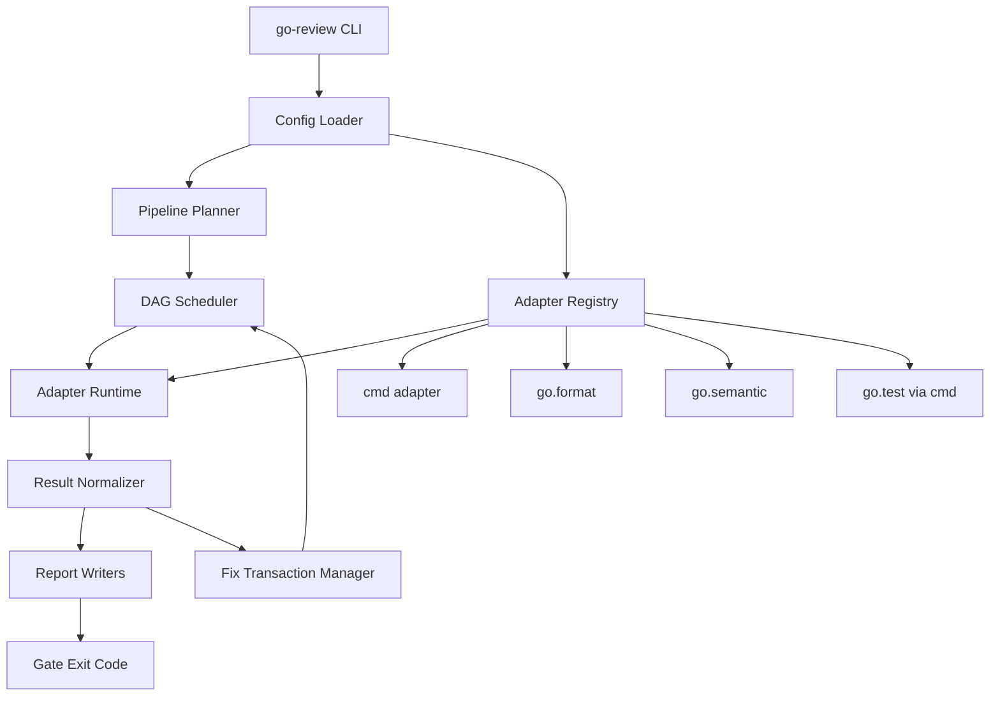

# Backend Overview

后端文档定义通用 Go code-review 编排平台的技术契约：adapter 生命周期、pipeline 调度、规则来源、检测执行、自动修复边界、报告输出和与任意工具的集成方式。

## 后端架构图

## 主题索引

| 主题 | Product Module | 状态 |
| --- | --- | --- |
| [rule-engine-and-autofix.md](rule-engine-and-autofix.md) | `tool-adapter-platform` / `review-pipeline` / `custom-rule-adapters` / `policy-and-autofix` / `regression-gates` | draft |

## 当前技术方向

- 平台提供自己的 CLI、adapter 运行时和 pipeline 调度器。
- 任意工具都可以通过 adapter 接入；`golangci-lint` 只是 `go.lint` adapter 的默认工具之一。
- 通过 Go `internal/`、`depguard` 和 package 依赖图表达架构规则。
- 通过 `go/analysis` 和 `SuggestedFix` 承载团队自定义语义检测与安全修复。
- 自动修复前后必须经过格式化、测试和最小验证。
