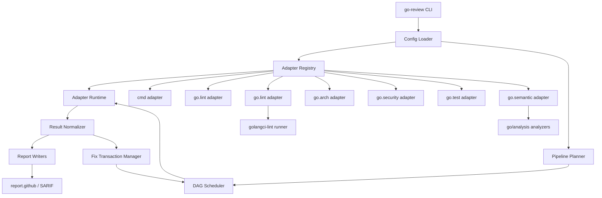

# Review Pipeline 与自动修复

本主题定义通用 Go code-review 编排平台的技术契约。核心引擎不绑定任何单一工具，只负责 adapter 生命周期、pipeline 调度、统一结果、修复事务、报告生成和门禁输出；格式化、lint、架构、安全、测试、报告和团队语义规则都作为 adapter 接入。

## 产品语义输入

| Product Module Key | 用户验收信号 | 来源 |
| --- | --- | --- |
| `tool-adapter-platform` | 一个配置文件能同时运行内置 adapter 和通用 `cmd` adapter | [产品能力](../product/go-code-quality-governance.md#工具接入平台) |
| `review-pipeline` | 配置能表达顺序、并行、依赖和失败策略 | [产品能力](../product/go-code-quality-governance.md#review-pipeline-编排) |
| `custom-rule-adapters` | 示例规则或外部工具能进入 pipeline 并影响门禁 | [产品能力](../product/go-code-quality-governance.md#自定义规约-adapter) |
| `policy-and-autofix` | 每个 adapter 和规则都有明确修复策略 | [产品能力](../product/go-code-quality-governance.md#策略与安全自动修复) |
| `regression-gates` | PR 和定时任务可复用同一套 pipeline 配置 | [产品能力](../product/go-code-quality-governance.md#回归门禁) |

## 主题定位和约束

平台不是替代 Go 编译器、测试或人工评审的系统。它负责把多个质量工具接成一个稳定、可复用、可审计的 review pipeline，把确定性违规报告出来，并在安全条件满足时生成可应用的修复。当前技术方向是把 `go/analysis` 作为自研 Go 语义规则底座，把 `golangci-lint` 作为通用 lint/format 聚合 runner，而不是把二者直接变成平台本体。

约束：

- 核心不硬编码具体工具；内置工具也通过 adapter 接口运行。
- adapter 可以包装成熟工具、自研工具、Go analyzer、测试命令或报告器。
- `golangci-lint` 只负责通用 lint/format 聚合，不替代 `go.test`、安全漏洞扫描、报告生成或 pipeline 编排。
- `go/analysis` 只负责 analyzer 编写和诊断表达，不负责 profile、artifact、中文/LLM 报告或跨工具调度。
- pipeline 必须能表达顺序、并行、依赖、超时、失败策略和 profile。
- 自动修复必须是局部、可格式化、可测试、可回滚的修改。
- 架构边界和目录归属默认不自动迁移，只报告违规。

## 核心设计



## Adapter 类型

| 类型 | 职责 | 示例 |
| --- | --- | --- |
| `command` | 运行任意外部命令 | 任意已有内部工具 |
| `checker` | 发现违规 | lint、架构规则、安全扫描 |
| `fixer` | 生成或应用修复 | 格式化、import 整理、局部安全替换 |
| `runner` | 执行测试或回归 | `go test`、race、coverage |
| `parser` | 把工具输出解析为统一结果 | JSON、JUnit、SARIF、go test 输出 |
| `reporter` | 输出 review 结果 | 终端、JSON、Markdown、SARIF、GitHub PR 评论 |
| `policy` | 处理严重级别、豁免和门禁策略 | profile、ignore、baseline |

一个 adapter 可以同时实现多个类型。例如 `go.lint` format step 既是 `checker` 也是 `fixer`。

## 通用工具接入契约

任意工具接入时，需要声明：

| 字段 | 含义 |
| --- | --- |
| `id` | adapter ID，例如 `go.lint` 或 `internal.naming-check` |
| `command` | 外部命令或内置 adapter 名称 |
| `args` | 参数模板 |
| `workdir` | 工作目录 |
| `env` | 环境变量 |
| `inputs` | 读取哪些文件或范围 |
| `outputs` | 输出格式和 artifact |
| `parser` | 如何把 stdout、stderr 或文件解析成统一结果 |
| `capabilities` | `check`、`fix`、`test`、`scan`、`report` |
| `timeout` | 最大执行时间 |
| `cache_key` | 可选缓存键 |

## Review Pipeline 模型

Pipeline 是有向无环图。每个 step 绑定一个 adapter，并声明依赖、失败策略和输出。

| 字段 | 含义 |
| --- | --- |
| `id` | step ID |
| `adapter` | 使用哪个 adapter |
| `depends_on` | 必须先完成的 steps |
| `run_if` | 执行条件，例如 changed files、profile、previous status |
| `parallel_group` | 可并行执行的分组 |
| `on_fail` | `stop`、`continue`、`skip_dependents` |
| `allow_fix` | 是否允许该 step 自动修复 |
| `artifacts` | 输出报告、覆盖率、SARIF、日志等 |

示例执行图：

```text
format-check
  -> lint
  -> arch
  -> test

security ------------------^

report-github depends_on: lint, arch, test, security
```

## 常用 Adapter

第一版提供常用 adapter，但平台边界不是这些工具：

| Adapter | 默认执行 | 主要输出 |
| --- | --- | --- |
| `cmd` | 任意外部命令 | 用户自定义解析结果 |
| `go.lint` | 委托 `golangci-lint`；默认 format step 使用 `golangci-lint fmt --enable gofmt`，也可聚合 `go vet`、`staticcheck`、`revive`、`errcheck` 等通用 lint | 格式/lint 违规和可应用修复 |
| `go.arch` | `depguard`、package 依赖图、自研 import boundary analyzer | 架构边界违规 |
| `go.security` | `gosec`、`govulncheck`；可由 `golangci-lint` 或独立命令接入 | 安全和漏洞问题 |
| `go.test` | `go test`、coverage、race，独立于 `golangci-lint` 保留 | 测试和回归结果 |
| `go.semantic` | 自研 `go/analysis` analyzer runtime / registry；当前内置 `no-direct-os-getenv` 和配置式 `no-direct-call` analyzer | 团队语义规约违规 |
| `report.github` | GitHub Checks、PR Review、SARIF | PR 评论和检查结果 |

## `go/analysis` 与 `golangci-lint` 的分工

| 层级 | 职责 | 不负责 |
| --- | --- | --- |
| `go/analysis` | 编写 Go 语义 analyzer，读取 AST/type info，产出 diagnostic / SuggestedFix | 不负责配置 profile、跨工具调度、报告归一、CI artifact |
| `golangci-lint` | 运行成熟通用 linters 和 formatters，提供缓存、并发和常见 formatter/fixer 能力 | 不替代 `go test`、自研 review pipeline、中文/LLM 报告、业务 semantic 规则治理 |
| `go-review` | 统一编排 lint/format/test/security/semantic/report steps，归一结果，执行 safe fix transaction，生成报告 | 不重复实现成熟 lint 规则，不把所有语义规则硬编码在 runner 中 |

推荐集成方式：

1. `go.lint` adapter 调用 `golangci-lint run`，`fix` 模式可调用 `golangci-lint run --fix`。
2. `go.semantic` adapter 运行平台内置或配置式 `go/analysis` analyzers，并把 diagnostics 映射为统一结果。
3. `go.test` adapter 继续独立调用 `go test ./...`、`go test -race` 或 coverage 命令，因为 linter runner 不承担测试回归职责。
4. 安全工具根据稳定性选择由 `golangci-lint` 聚合或由 `go.security` 独立命令接入；无论哪种方式都进入统一 result model。

## 统一结果模型

| 字段 | 含义 |
| --- | --- |
| `adapter_id` | 来源 adapter |
| `step_id` | 来源 pipeline step |
| `rule_id` | 触发规则或检查项 |
| `kind` | `violation`、`test`、`coverage`、`security`、`artifact` |
| `file` | 文件路径 |
| `line` | 行号 |
| `column` | 列号 |
| `message` | 违规或失败原因 |
| `suggestion` | 修复建议 |
| `fix_available` | 是否存在自动修复 |
| `fix_safety` | `safe`、`review`、`none` |
| `gate_status` | `pass`、`warn`、`fail` |

## 执行流程

```text
Load Config
  -> Resolve Adapters
  -> Build Pipeline DAG
  -> Execute Ready Steps
  -> Parse and Normalize Results
  -> Apply Safe Fixes when requested
  -> Re-run Affected Steps
  -> Write Reports and Artifacts
  -> Return Gate Exit Code
```

## 自动修复契约

自动修复分为三档：

| 档位 | 含义 | 示例 |
| --- | --- | --- |
| `safe` | 可证明局部语义不变，允许自动应用 | import 排序、格式化、确定性的局部替换 |
| `review` | 可以生成建议，但不默认应用 | 错误处理结构调整、复杂条件拆分 |
| `none` | 只报告 | 架构迁移、业务逻辑重写、危险字段写操作 |

修复流程：

```text
Diagnostic
  -> Suggested Fix or Text Edit
  -> Conflict Check
  -> Apply in Transaction
  -> Run Formatter
  -> Re-run Dependent Steps
  -> Commit Fix Result or Roll Back
```

## 示例规则：对象访问约束

字段访问只是示例，不是内置主线规则。它说明平台为什么需要语义 adapter：

- 简单文本替换无法区分读取、写入、取地址和同名字段。
- 安全修复需要知道表达式的真实类型。
- 某些场景可以自动修，某些场景只能报告。

因此这类规则应该作为 `go.semantic` analyzer 示例或外部工具 adapter，而不是产品内置固定规则。

当前代码基线提供了一个最小 `go.semantic` 示例规则：`semantic.no-direct-os-getenv`。它通过 `go/analysis` analyzer 基于 AST/type info 定位直接 `os.Getenv` 调用，并把诊断映射为统一 violation，包含 adapter ID、step ID、rule ID、文件、行列、原因、建议和 `review` 修复安全级别。该规则用于证明语义检查可以进入 profile 并影响门禁；它不是完整的任意规则 DSL，也不是动态加载不可信规则代码的插件市场，也不提供 semantic 自动修复。当前 adapter 仍遵循 step-level 单 `Result` 契约：同一次 semantic step 只报告首个 failing finding，不承诺输出多 diagnostics。

默认项目初始化会生成 `.go-review/semantic/default.yaml` 和 `.go-review/semantic/custom.yaml`：`default.yaml` 放框架自带规则，`custom.yaml` 留给团队配置已实现的语义规则。当前配置式 custom rule 覆盖有限的 analyzer kind：`no-direct-call` 和 `max-params`。返回值数量、函数体行数、架构边界等规则需要新增 `go/analysis` analyzer 或通过外部工具接入。adapter 配置里的 `parser` 仅是兼容的内置规则选择入口，不是 parser 插件机制。忽略目录不放在 semantic 文件里，而是放在 `.go-review/go-review.yaml` 顶层 `exclude`，例如 `exclude: [vendor, testdata]`；这是项目级配置，配置后所有内置扫描类步骤都应跳过这些路径。主配置只需要一个 `go.semantic` adapter 和一个 `semantic` step，不需要按 `cmd/internal/integration` 拆成多个 semantic step。

## 失败和安全策略

- adapter 启动失败时，按 step 的 `on_fail` 决定继续、跳过下游或失败。
- 自动修复后格式化失败时，回滚该修复并报告。
- 自动修复后依赖 step 失败时，保留失败证据，不把该修复标记为安全完成。
- 同一文件存在多个互相重叠的 text edit 时，必须拒绝自动应用并转人工处理。
- 豁免必须记录 adapter ID、规则 ID、原因和范围。
- CI 环境默认只检查，不直接改写主分支代码。
- `fix` 命令当前只会自动应用配置为 `safe` 且 step `allow_fix: true` 的 `go.lint` format 修复；随后运行依赖验证 step，验证失败时回滚已应用格式化修改并保留失败证据。

## 测试策略

| 测试对象 | 验证方式 |
| --- | --- |
| adapter 配置 | 使用 fixture 项目验证启停、参数、输出解析和超时 |
| pipeline 调度 | 验证顺序、并行、依赖、失败策略和 profile |
| 常用 adapter | 用故意违规样例验证每个 adapter 能产出统一结果 |
| 自定义语义 adapter | 当前用 engine fixture 覆盖 `go/analysis` analyzer 的 AST 和类型边界；后续可补 `analysistest` |
| 自动修复 | golden file 验证修复前后代码 |
| 报告输出 | 快照测试验证终端、JSON、Markdown、SARIF 输出 |
| 回归门禁 | 用故意违规样例确认门禁失败 |

## 相关决策

- [B-1](../_process/backend/DECISIONS.md#b-1-通用规则优先复用成熟-go-工具链)：通用规则优先复用成熟 Go 工具链。
- [B-2](../_process/backend/DECISIONS.md#b-2-自定义语义规则通过-goanalysis-承载)：自定义语义规则通过 `go/analysis` 承载。
- [B-3](../_process/backend/DECISIONS.md#b-3-平台提供自己的-cli并把-golangci-lint-作为-adapter-调用)：平台提供自己的 CLI，并把 `golangci-lint` 作为 adapter 调用。
- [B-4](../_process/backend/DECISIONS.md#b-4-核心引擎采用工具无关-adapter-和-pipeline-dag)：核心引擎采用工具无关 adapter 和 pipeline DAG。
- [B-5](../_process/backend/DECISIONS.md#b-5-第一版配置采用简单稳定-yaml-schema)：第一版配置采用简单稳定 YAML schema。
