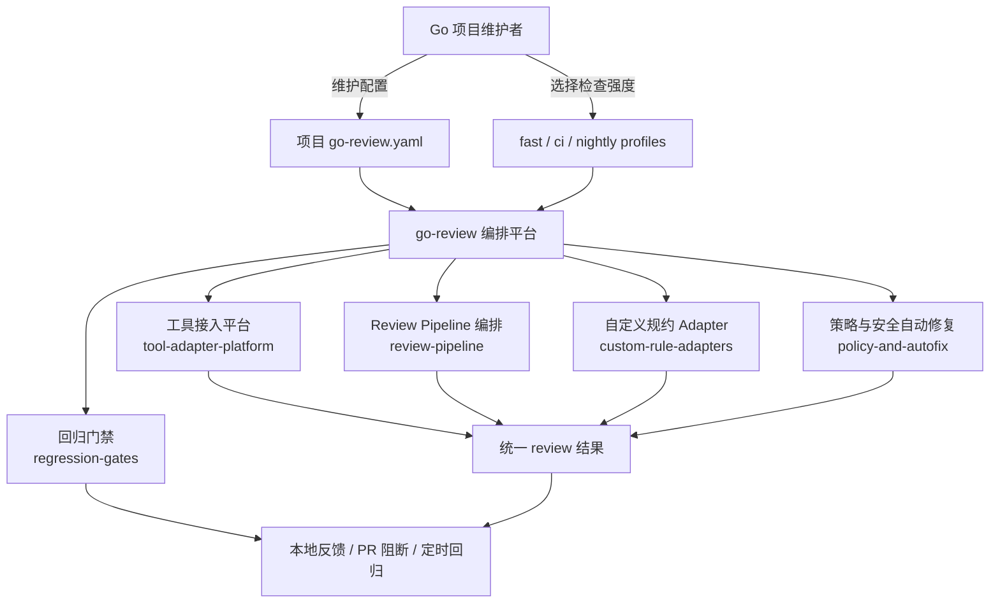

# Product Overview

本产品面向 Go 项目维护者，提供通用 code-review 编排能力。它不先定义 AI agent，也不绑定单一检查工具，而是把工具接入、执行顺序、规约检测、自动修复和回归门禁沉淀成可配置平台。

## 产品架构图

## 产品能力地图

| 能力文档 | 定位 | 状态 |
| --- | --- | --- |
| [go-code-quality-governance.md](go-code-quality-governance.md) | Go 代码质量规约治理能力源 | draft |

## Module Key 索引

| Module Key | 模块 | 产品来源 | Backend | Quality |
| --- | --- | --- | --- | --- |
| `tool-adapter-platform` | 工具接入平台 | [Go 代码质量规约治理](go-code-quality-governance.md#工具接入平台) | [规则引擎与自动修复](../backend/rule-engine-and-autofix.md) | [Go 代码质量基线](../quality/go-code-quality-baseline.md) |
| `review-pipeline` | Review Pipeline 编排 | [Go 代码质量规约治理](go-code-quality-governance.md#review-pipeline-编排) | [规则引擎与自动修复](../backend/rule-engine-and-autofix.md) | [Go 代码质量基线](../quality/go-code-quality-baseline.md) |
| `custom-rule-adapters` | 自定义规约 Adapter | [Go 代码质量规约治理](go-code-quality-governance.md#自定义规约-adapter) | [规则引擎与自动修复](../backend/rule-engine-and-autofix.md) | [Go 代码质量基线](../quality/go-code-quality-baseline.md) |
| `policy-and-autofix` | 策略与安全自动修复 | [Go 代码质量规约治理](go-code-quality-governance.md#策略与安全自动修复) | [规则引擎与自动修复](../backend/rule-engine-and-autofix.md) | [Go 代码质量基线](../quality/go-code-quality-baseline.md) |
| `regression-gates` | 回归门禁 | [Go 代码质量规约治理](go-code-quality-governance.md#回归门禁) | [规则引擎与自动修复](../backend/rule-engine-and-autofix.md) | [Definition of Done](../quality/definition-of-done.md) |

## 阅读顺序

1. [go-code-quality-governance.md](go-code-quality-governance.md)
2. [../backend/rule-engine-and-autofix.md](../backend/rule-engine-and-autofix.md)
3. [../quality/go-code-quality-baseline.md](../quality/go-code-quality-baseline.md)
4. [../quality/definition-of-done.md](../quality/definition-of-done.md)
