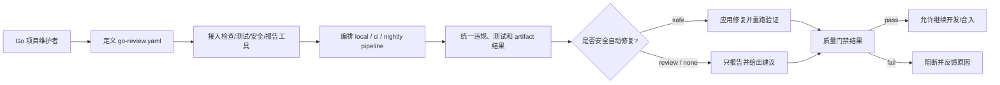

# Go 代码质量规约治理

本能力把 Go code-review 从“运行某个固定工具”升级为“可编排的工具无关质量平台”。用户可以接入任意 Go 检查、修复、测试、安全、架构或报告工具，并通过配置定义执行顺序、依赖关系、失败策略、自动修复策略和不同场景的门禁 profile。

## 产品背景与定位

Go 项目长期维护时，质量退化通常不是单点 bug，而是目录边界被打破、依赖方向漂移、代码风格不一致、错误处理和安全规则被绕过，以及团队约定无法稳定执行。

单个工具只能解决一部分问题。成熟团队真正需要的是一个通用 code-review 编排层：

- 接入任意工具，而不是绑定 `golangci-lint` 或某个固定生态。
- 定义工具运行顺序、并行关系和依赖关系。
- 把不同工具的输出归一成统一 review 结果。
- 在安全场景下执行自动修复。
- 让本地、PR、主分支和定时全量回归使用同一套 pipeline。

## 目标用户与场景

| 用户 | 场景 | 成功信号 |
| --- | --- | --- |
| 项目负责人 | 希望目录结构和架构边界长期稳定 | 新增代码无法绕过架构约束合入 |
| Go 开发者 | 提交代码前希望自动发现和修复规范问题 | 本地命令能按 pipeline 输出明确修复结果或违规原因 |
| 代码审查者 | 不想在 PR 中反复指出格式、命名、依赖方向问题 | PR 评论聚焦业务逻辑和设计，不再消耗在机械规范 |
| 平台维护者 | 希望统一多个项目的 Go 质量门禁 | 不同项目能复用 adapter 和 pipeline profile |

## 范围

包含：

- 工具 adapter 加载、配置、执行和结果归一。
- Review pipeline 的顺序、依赖、并行、超时、失败策略和 profile。
- Go 格式化、import 顺序、静态检查、安全扫描、测试回归和架构规则。
- 团队自定义规约 adapter，例如对象访问、日志、错误处理、配置读取、时间获取等业务语义约束。
- 可证明安全的自动修复。
- 本地、PR、主分支和定时全量回归门禁。

不包含：

- 直接用 AI 判定代码是否可合入。
- 不经过测试验证的任意自动改写。
- 替代人工架构设计和业务代码审查。
- 在产品层定义具体 Go AST、API、事件或文件实现细节。

## 用户可感知的核心概念

| 概念 | 用户语义 |
| --- | --- |
| Tool Adapter | 一个可配置的工具接入单元，可以运行外部命令、Go analyzer、测试或报告输出 |
| Review Pipeline | 一组按顺序或依赖关系执行的 review steps |
| Step | pipeline 中的一个执行节点，绑定一个 adapter 和一组参数 |
| Profile | 本地、PR、主分支、nightly 等不同场景的 pipeline 配置 |
| 统一结果 | 平台把不同工具输出转换成同一套 violation / fix / report 结构 |
| 违规 | 工具发现的不合规代码、依赖、目录或配置问题 |
| 自动修复 | adapter 可以证明安全时执行的局部代码改写 |
| 只报告违规 | adapter 无法证明安全时，只提示位置、原因和建议，不修改代码 |
| 回归门禁 | 在提交、PR、主分支或定时任务中运行的质量检查 |
| 豁免 | 对特定违规的显式例外，必须有原因和范围 |

## 功能模块索引

| Module Key | 模块 | 用户价值 | 状态 |
| --- | --- | --- | --- |
| `tool-adapter-platform` | 工具接入平台 | 任意检查、修复、测试、安全和报告工具都能接入平台 | draft |
| `review-pipeline` | Review Pipeline 编排 | 用户可以定义工具先后顺序、依赖关系和失败策略 | draft |
| `custom-rule-adapters` | 自定义规约 Adapter | 团队可以把自己的编码规约接成 adapter | draft |
| `policy-and-autofix` | 策略与安全自动修复 | 减少机械修复成本，同时避免破坏代码语义 | draft |
| `regression-gates` | 回归门禁 | 保证规则长期执行，不随项目演进失效 | draft |

## 产品能力闭环图



## 工具接入平台

`tool-adapter-platform` 是最小核心。它不关心某个工具是否叫 linter、tester、scanner 或 reporter，只要求 adapter 按契约输入输出。

| 能力 | 用户价值 |
| --- | --- |
| 工具发现 | 项目能声明启用哪些内置 adapter、自定义 adapter 或外部命令 |
| 参数配置 | 每个工具可以配置命令、参数、工作目录、环境变量、超时和作用范围 |
| 输出解析 | 文本、JSON、JUnit、SARIF、coverage、go test 输出都能归一到统一结果 |
| 能力声明 | adapter 声明自己能 check、fix、test、scan 或 report |
| 版本锁定 | 项目能锁定工具版本，避免本地和 CI 结果漂移 |
| 结果归一 | 所有工具输出统一的违规、测试、修复和报告结构 |

第一版建议提供常用 adapter，但不把它们当作平台边界：

| Adapter | 默认接入工具 | 能力 |
| --- | --- | --- |
| `cmd` | 任意外部命令 | 通用接入 |
| `go.format` | `gofmt`、`goimports`、`gofumpt`、`gci` | 格式检查和修复 |
| `go.lint` | `golangci-lint`、`go vet`、`staticcheck`、`revive` 等 | lint |
| `go.arch` | `internal/`、`depguard`、package 依赖图 | 架构约束 |
| `go.security` | `gosec`、`govulncheck` | 安全和漏洞扫描 |
| `go.test` | `go test`、coverage、race | 测试回归 |
| `go.semantic` | 自定义 `go/analysis` analyzer | 团队语义规约 |
| `report.github` | GitHub Checks、PR 评论、SARIF | Review 报告 |

### Story 候选

| Story Key | 用户价值 | 范围 | 验收信号 | 依赖 | 状态 |
| --- | --- | --- | --- | --- | --- |
| `tool-adapter-platform-core` | 用户可以接入多个不同工具 | adapter 注册、配置读取、命令执行、结果归一；不实现复杂规则 | 一个配置文件能同时运行内置 adapter 和通用 `cmd` adapter | Backend / Quality | ready |
| `tool-adapter-platform-output-normalization` | 用户能看到统一 review 结果 | 支持至少文本、JSON、go test、SARIF 的基础解析 | 不同工具结果能归一为统一 violation/test/report 结构 | Backend / Quality | ready |

## Review Pipeline 编排

`review-pipeline` 定义工具如何运行，而不是只定义“启用哪些工具”。

Pipeline 需要支持：

| 能力 | 用户价值 |
| --- | --- |
| 顺序执行 | 例如先 format，再 lint，再 test |
| 并行执行 | 例如 lint、安全扫描、部分测试可以并行 |
| 依赖关系 | 例如自动修复后必须重新 lint，测试依赖编译通过 |
| 失败策略 | 某 step 失败后继续、跳过下游或立即失败 |
| Profile | 本地、PR、main、nightly 使用不同 pipeline |
| 作用范围 | PR 只跑变更影响范围，nightly 跑全量 |
| 缓存与复用 | 相同输入不重复执行昂贵步骤 |

示例语义：

```text
local:
  format -> lint-fast -> test-affected

ci:
  format-check -> lint -> arch -> security -> test

nightly:
  full-lint + full-test + race + vuln + slow-custom-rules
```

### Story 候选

| Story Key | 用户价值 | 范围 | 验收信号 | 依赖 | 状态 |
| --- | --- | --- | --- | --- | --- |
| `review-pipeline-dag-execution` | 用户可以定义工具先后顺序和依赖关系 | 支持顺序、并行、依赖和失败策略 | 配置能表达 `format -> lint -> test` 和并行安全扫描 | Backend / Quality | ready |
| `review-pipeline-profiles` | 用户可以按场景使用不同检查强度 | 提供 `local`、`ci`、`main`、`nightly` profile | 不同 profile 能运行不同 steps 和失败策略 | Backend / Quality | ready |

## 自定义规约 Adapter

`custom-rule-adapters` 让团队把自己的编码规约接入平台。它可以是 Go 语义规则，也可以是任意外部工具。

典型规则包括：

| 规则类型 | 示例 |
| --- | --- |
| 对象访问 | 某些对象字段不能直接读写，必须走指定方法 |
| 错误处理 | 错误必须 wrap，禁止吞掉错误 |
| 日志规范 | 业务日志必须带 trace id 或 request id |
| 配置读取 | 业务代码不能直接调用 `os.Getenv` |
| 时间来源 | 业务逻辑不能直接调用 `time.Now`，必须使用注入时钟 |
| 依赖限制 | 某些目录不能依赖 Web 框架、ORM 或基础设施包 |

字段访问只是一个例子，不是产品主线。平台要支持这类规则，是因为它能代表“团队自定义语义规约”：需要看 Go 语法树和类型信息，不能靠简单文本替换。

### Story 候选

| Story Key | 用户价值 | 范围 | 验收信号 | 依赖 | 状态 |
| --- | --- | --- | --- | --- | --- |
| `custom-rule-adapters-sdk` | 团队可以编写自己的规则 adapter | 提供规则 adapter 接口、测试样例和本地运行方式 | 一个示例 adapter 能检测违规并输出统一报告 | Backend / Quality | ready |
| `custom-rule-adapters-command` | 团队可以接入任意已有工具 | 用通用 `cmd` adapter 接入外部命令并解析输出 | 一个非内置工具能进入 pipeline 并影响门禁 | Backend / Quality | ready |

## 策略与安全自动修复

`policy-and-autofix` 定义哪些 adapter 可以自动修复、哪些只能报告。自动修复规则必须满足：

- 能定位到确定的语法节点或文本区间。
- 能确认修复不会改变业务语义。
- 修复后必须通过格式化。
- 需要代码语义的修复必须通过目标测试或 fixture 验证。
- 无法确认安全时只报告。

自动修复分三类：

| 策略 | 含义 | 示例 |
| --- | --- | --- |
| `safe` | 可以自动应用 | 格式化、import 排序、确定性的局部替换 |
| `review` | 只生成建议，默认不应用 | 错误处理结构调整、复杂条件拆分 |
| `report-only` | 只报告 | 架构迁移、业务逻辑重写、跨文件重构 |

### Story 候选

| Story Key | 用户价值 | 范围 | 验收信号 | 依赖 | 状态 |
| --- | --- | --- | --- | --- | --- |
| `policy-and-autofix-safety-levels` | 用户知道哪些违规会被自动修、哪些只报告 | 定义 `safe`、`review`、`report-only` 三档策略 | 每个 adapter 和规则都有明确修复策略 | Backend / Quality | ready |
| `policy-and-autofix-transaction` | 用户可以安全应用自动修复 | 支持预览、应用、格式化、验证和失败回滚 | 修复失败不会留下半完成状态 | Backend / Quality | ready |

## 回归门禁

`regression-gates` 让 code-review pipeline 长期生效。

| 门禁 | 目标 | 推荐行为 |
| --- | --- | --- |
| 本地提交前 | 快速反馈 | 运行 format、fast lint、受影响测试和安全自动修复 |
| PR | 合入前检测 | 运行 lint、测试、架构、安全和报告 steps |
| 主分支 | 阻止质量退化 | 必须通过 required status checks |
| 定时全量 | 发现长期和慢速问题 | 跑全量测试、race、漏洞扫描和长耗时工具 |

### Story 候选

| Story Key | 用户价值 | 范围 | 验收信号 | 依赖 | 状态 |
| --- | --- | --- | --- | --- | --- |
| `regression-gates-local-fast-check` | 开发者提交前获得快速反馈 | 本地运行格式化、快速 lint 和安全修复 | 本地命令能在失败时给出明确原因 | Quality | ready |
| `regression-gates-pr-quality-check` | PR 合入前自动发现违规 | CI 运行可编排 review pipeline | 违规 PR 无法合入，结果可读 | Quality | ready |
| `regression-gates-scheduled-full-regression` | 团队能定时发现慢速和全量问题 | 定时跑全量测试、race、漏洞扫描和长耗时工具 | 定时任务产出可追踪报告 | Quality | ready |

## 边界和异常情况

- 平台不绑定任何单一工具；内置 adapter 是默认能力，不是平台边界。
- Go 规约不能照搬 Java 规则，规则必须按 Go 语言和项目约定重新定义。
- 自动修复不应跨文件进行大规模重构，除非有明确迁移计划和回归测试。
- 架构违规通常只报告和阻断，不自动移动代码。
- 豁免必须有原因、范围和过期条件，避免 `nolint` 成为永久逃逸口。

## 验收提示

- 给定一个配置文件，用户能接入和关闭不同工具 adapter。
- 给定多个 adapter，用户能配置先后顺序、并行关系和失败策略。
- 给定一个非内置外部命令，平台能通过通用 adapter 运行并归一结果。
- 给定一个违反格式或 import 顺序的文件，格式化 adapter 能自动修复。
- 给定一个违反架构依赖方向的 import，架构 adapter 能定位并阻断。
- 给定一个危险修复场景，平台只报告，不自动改。
- PR 和定时回归都能运行同一套 pipeline 配置。

## 相关决策

- [P-1](../_process/product/DECISIONS.md#p-1-先落地工具化规约治理而不是先做-ai-agent)：先落地工具化规约治理，而不是先做 AI agent。
- [P-2](../_process/product/DECISIONS.md#p-2-自动修复只覆盖语义安全子集)：自动修复只覆盖语义安全子集。
- [P-3](../_process/product/DECISIONS.md#p-3-所有质量能力都采用-adapter-形态)：所有质量能力都采用 adapter 形态。
- [P-4](../_process/product/DECISIONS.md#p-4-核心能力升级为工具无关的-review-pipeline-编排)：核心能力升级为工具无关的 review pipeline 编排。
- [P-5](../_process/product/DECISIONS.md#p-5-第一版交付常用-adapter不做-adapter-市场)：第一版交付常用 adapter，不做 adapter 市场。
